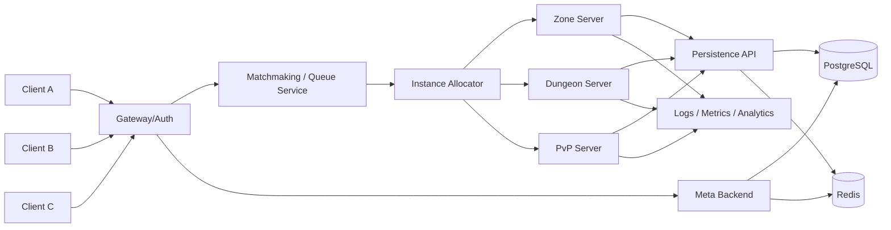
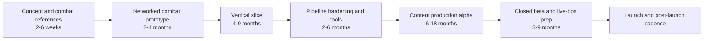

# Feasibility of Building an MMORPG with World of Warcraft Vibes and TERA-Style Mechanics

> **Document status - historical feasibility research.** Recommendations for
> flagged or arena-first PvP, WoW-like layered talent trees, and
> instance-centered world design are not current product decisions. The
> canonical direction uses separate faction starts, mandatory PvP in mixed
> territories, safe neutral cities, invasion-enabled faction capitals, faction
> Doctrines, Skein Weaving, and meaningful but bounded equipment power. See the
> [Documentation Index](../documentation-index.md) and
> [Game Design Bible](../game-design-bible.md). Technical evidence in this report
> remains useful unless newer repository guidance supersedes it.

## Executive Summary

A game that combines **World of Warcraft-style readability, class fantasy, and long-term progression** with **TERA-style non-target action combat** is technically feasible in 2026, but the answer changes dramatically depending on scope. A **small indie team** can realistically ship an **MMO-lite or instanced online action RPG** with shared hubs, a few open zones, small-scale PvP, and persistent character data. A **mid-size studio** can plausibly ship a “real MMORPG” with multiple shards, several zones, structured PvE/PvP, and live-service tooling. A **full-scale seamless-content MMORPG** with broad PvE, PvP, economy, live ops, and high content velocity remains a **multi-year, tens-of-millions-to-hundreds-of-millions** undertaking. In practice, the central feasibility constraint is not just networking code; it is **content throughput, combat feel, persistence integrity, live operations, and team coordination**.

For this exact hybrid, **Unreal Engine is the strongest default choice**. Unreal currently offers built-in dedicated server workflows, mature client/server replication, scaling-oriented replication features, the Gameplay Ability System for RPG-style abilities and attributes, Lyra as a multiplayer reference project, World Partition for large streamed worlds, Niagara for VFX, and modern IK retargeting plus motion-matching tooling for responsive melee combat and animation reuse. Unity is viable—especially for C#-first teams—but it generally requires more assembly work to reach the same action-combat feel and stylized production quality for an MMO-like RPG.

The **recommended architecture** for most teams is not a single seamless mega-world. It is **authoritative dedicated servers** for combat simulation, **instance or shard-based world segmentation**, **persistent meta/backend services** for accounts, inventory, social systems, matchmaking, and economy, plus **durable storage** in SQL and **fast ephemeral/state/event infrastructure** in Redis-like systems. That architecture aligns with Unreal’s client/server model, Nakama’s authoritative match and storage patterns, PlayFab’s LiveOps/economy capabilities, Agones/GameLift’s server orchestration, and Open Match-style queueing if you need elastic matchmaking.

The blunt strategic recommendation is this: if your budget and team are not already at mid-size-studio scale, do **not** start with “a WoW-sized MMORPG.” Start with **one combat slice, one town, one outdoor zone, one dungeon, two-to-four classes, one PvP mode, and one persistence loop**. Prove combat feel first. Then prove netcode. Then prove content production. Only then broaden the world. That is the highest-probability path to something both playable and fundable. This is an inference from the tooling available, engine architecture, and the staffing/economic reality reflected by current salary and service cost data.

## Feasibility and Target Scope

“Feasible” depends on what you mean by **MMORPG**. If you mean **persistent characters, social systems, shared areas, dungeons, progression, and a live server**, then yes—this is feasible for a disciplined small team if they build an **instanced, shard-based MMO-lite**. If you mean **large seamless world, multiple endgame loops, robust economy, high concurrency, broad PvP, raids, fast content cadence, anti-cheat, and full GM/live-ops service**, then the project becomes mid-size or AAA by default. The reason is that modern engines and middleware reduce infrastructure burden, but they do not reduce the cost of **content**, **combat tuning**, or **operational complexity**.

### Scope comparison

| Scope | Practical product shape | Core team | Development window | Indicative development cost | Main advantages | Main liabilities | Best verdict |
|---|---|---:|---:|---:|---|---|---|
| Small indie | MMO-lite: shared hub, 1–2 open adventure zones, 1–3 instanced dungeons, 2–4 classes, light PvP, persistent progression | 6–12 | 18–30 months | **~$1.5M–$5M** modeled from blended salaries plus overhead, tools, and cloud | Achievable, fundable, testable; best odds of shipping | Must cut breadth hard; no seamless world; content must be reused aggressively | **Best starting scope** |
| Mid-size studio | “Real” shard-based MMORPG: several zones, 4–8 classes, dungeon ladder, world bosses, ranked PvP, guilds, economy, analytics, live ops | 25–50 | 30–48 months | **~$12M–$40M** | Strong chance of marketable MMORPG identity | Demands real production discipline, backend maturity, and outsourcing | **Viable with funding** |
| Full-scale MMO | Broad-content MMORPG with multi-year roadmap, large world, high concurrency, extensive PvE/PvP, deep live-service support | 100–250+ | 48–84 months | **~$80M–$300M+** dev-only, excluding major marketing | Competitive at genre top tier | Highest risk of schedule slip, content debt, and runaway operating cost | **Only for heavily funded studio/publisher** |

The cost ranges above are modeled from current U.S. median pay for software developers, QA analysts/testers, special effects artists/animators, and producers/directors, with standard employer overhead and tool/cloud budgets layered on top. Those medians alone are roughly $133,080 for software developers, $102,610 for QA testers, $99,800 for special effects artists/animators, and $83,480 for producers/directors, before benefits, software licenses, recruiting, outsourcing, and live infrastructure.

### What each scope should and should not attempt

A **small indie** should target a **hub-and-spoke server structure**: a capital hub, zone instances, dungeon instances, and small PvP instances. It should avoid seamless overworld design, player housing at launch, deep crafting economies, auction houses, raids, and complex social moderation tools. Unreal’s dedicated server model and Lyra-derived multiplayer patterns support this kind of architecture much more cleanly than a monolithic seamless world ambition.

A **mid-size studio** can add broader persistence: guilds, richer itemization, world events, structured matchmaking, stronger analytics, account services, and more tailored live-ops feature flags. Backends like Nakama and PlayFab become much more attractive here because their social, leaderboard, tournament, storage, and LiveOps primitives reduce custom backend work.

A **full-scale MMO** is where custom infrastructure choices can become rational, but often only after a team has exhausted stock engine and middleware options. The fact that Unreal and Unity now ship mature multiplayer, dedicated server, content streaming, visual effects, animation retargeting, and build/deployment support means a custom engine is no longer the default “serious MMO” choice; it is a **special-case choice for organizations that can afford a platform team**. That conclusion is an inference from the capability surface of current engine ecosystems.

## Core Gameplay Systems

The game-design challenge is not merely “combine WoW and TERA.” Those games excel in different places. WoW’s strength is **class readability, progression structure, role definition, dungeon/raid scripting, and long-term retention systems**. TERA’s signature is **non-target action combat**, where aiming, dodging, blocking, timing, and spatial commitment matter directly. Your design job is to build a ruleset where those strengths reinforce each other instead of colliding.

### Combat, targeting, and hit detection

TERA is officially described by Krafton as an MMORPG with the genre’s first **non-targeting combat system** and **non-targeting action battles**; public game descriptions also emphasize aiming, dodging, and timing. For your project, that implies a combat model built on **camera-relative movement, directional attacks, dodge/block windows, server-validated hit detection, and deliberate animation commitment**, rather than on pure tab-target locking.

Mechanically, the most defensible implementation is this:

- **Client** captures input instantly, predicts local movement, and plays anticipation/FX early for responsiveness.
- **Server** remains authoritative on movement correction, ability execution eligibility, hit determination, resource costs, cooldowns, and damage outcomes.
- **Hit detection** should be ability-specific: swept traces for melee arcs, cone/sphere overlap volumes for short-range cleaves, projectile actors for missiles, and ground-targeted shapes for telegraphs.
- **Timing windows** for dodge, invulnerability frames, parry/block checks, and interrupt states should be resolved on the server using a simulation tick and ability-state timeline.

That model is aligned with Unreal’s authoritative dedicated server approach and Unity’s server-authoritative client-prediction guidance.

A practical **TERA-like but MMO-manageable** targeting stack looks like this:

| Ability type | Recommended validation | Why it fits |
|---|---|---|
| Basic melee combo | Swept capsule or box traces along animation path | Good readability, deterministic enough for server authority |
| Charged slash / cleave | Cone or arc query from weapon root or chest socket | Preserves “face your target” action feel |
| Lunge / gap closer | Server-validated movement + end-frame impact check | Prevents dash-desync abuse |
| Projectile | Server-owned projectile or rewind-assisted validation | Fairer under latency |
| Block / guard | Frontal angle gate + stamina/guard resource | Strong TERA-like skill expression |
| Dodge / iframe | Ability-state window checked by server tick | Preserves action-combat feel without trusting client claims |

Unreal’s Gameplay Ability System is particularly well-suited here because it gives you a framework for abilities, attributes, effects, and cues, and Lyra demonstrates how a customized GAS-based multiplayer game can be organized.

### Class design, skill trees, and progression

If you want the **WoW side** of the hybrid to matter, do not just bolt a talent tree onto an action game. Use WoW’s current model as inspiration: **baseline class fantasy**, **spec identity**, and **layered talent selection**. Blizzard’s modern structure includes class talents, specialization talents, Hero Talents, and—going into Midnight—Apex Talents. That layered approach is a strong template for delivering build identity without requiring dozens of hotbar skills.

A workable adaptation for your game is:

- **Class layer**: movement tech, survival passives, signature resource mechanics, utility.
- **Spec layer**: weapon style, role emphasis, combo interactions, specialty defenses.
- **Hero/Apex-like layer**: fantasy-defining branch that changes cadence, proc logic, endgame identity, or transformation mechanics.
- **Loadout system**: save several builds, because action MMORPG players frequently swap PvE/PvP or solo/group setups.

This structure maps cleanly onto GAS attributes/effects/tags in Unreal, and it is also compatible with data-driven class design in Unity.

For **progression**, the safest design is to separate three layers of persistence:

1. **Character progression**: level, talents, gear, skill unlocks.
2. **Account progression**: currency, account unlocks, cosmetics, shared achievements.
3. **Session combat state**: temporary buffs, encounter state, cooldown snapshots, instance state.

That separation prevents fragile systems where world-server crashes corrupt long-term data. Backends such as Nakama explicitly support project-specific data storage with access controls and authoritative write patterns, while Redis is suitable for fast event or pub/sub workloads and PostgreSQL remains the durable source of truth for relational state.

### PvE, PvP, networking, and persistence

For **PvE**, small and mid-size teams should emphasize **replayable instanced content** over broad zone count. One good outdoor loop, one excellent dungeon, and one strong world boss are worth more than five shallow regions. Networked action combat magnifies encounter scripting value because telegraphs, positioning checks, block tests, and interrupt windows become meaningful. That leverages the TERA side of the fantasy without requiring huge world-team throughput. This is a design inference grounded in the cost structure and tooling above.

For **PvP**, start with one of these, in order of implementation efficiency:

| Priority | Mode | Why it is smart first |
|---|---|---|
| Highest | Small arena PvP | Contained map, clean skill-expression loop, easy to test latency and balance |
| High | Battleground / control-point map | Lets you validate objective play and class roles |
| Medium | Open-world flagged PvP | Strong MMO flavor, but creates moderation, griefing, and balance issues |
| Lowest initially | Full realm warfare or siege | Massive design and server burden |

The networking model behind all of this should remain **server authoritative**. Unreal’s dedicated server documentation is explicit: the server moderates the true game state and replicates changes to clients. Unity’s Netcode for Entities is likewise positioned as a server-authoritative networking solution with client prediction, and its Megacity sample demonstrates 64+ player patterns.

For **persistence**, your minimum viable durable state model should include: account, character, inventory, equipment loadout, quest flags, talent choices, stash, social graph, and transaction logs. Everything else can be layered later. Durable game state belongs in a transactional database; ephemeral queueing, event fan-out, cache, and coordination work better in Redis-style infrastructure.

## Art and Visual Pipeline

The safest way to interpret “**WoW-style visuals/vibes**” is **not** “imitate Blizzard art too closely.” It is to target **stylized readability**: strong silhouettes, saturated but controlled color language, hand-painted or painterly surface treatment, clear VFX signaling, readable enemy telegraphs, and class-specific spell identity. That approach is also safer legally, because copyright protects expression rather than general ideas or methods, and trademarks protect names, logos, and source identifiers. You may emulate high-level genre qualities; you should not clone protected art, names, logos, or distinctive assets.

### Recommended visual target

For this project, the strongest art direction is:

- **Stylized fantasy**, not photorealism.
- **Mid-frequency detail**, not ultra-fine texture noise.
- **Exaggerated silhouettes** for class readability.
- **Telegraph-forward VFX** in combat.
- **Selective use of outline/post-process stylization**, not heavy global cel-shading that obscures materials.
- **Readable animation posing**, especially on attack startup, hit frames, dodge frames, and guard states.

Epic’s long-standing stylized rendering examples emphasize hand-painted materials and post-process techniques, and Unreal 5.8 now introduces experimental Substrate Toon Shading. The important production takeaway is that stylization is well-supported, but experimental rendering features should be treated cautiously in a shipping MMO pipeline until your performance and material workflows are proven.

Unity can also support stylized visuals, and Unity now has a Toon Shader package plus Shader Graph and VFX Graph. The major caveat is that the Toon Shader package is still a preview package and Unity’s Visual Effect Graph documentation still says full URP support is in development, which matters if you want a scalable stylized MMO target on URP.

### Production pipeline by asset category

| Pipeline stage | Deliverables | Recommended tools | Why these tools fit | Sources |
|---|---|---|---|---|
| Concept and look dev | style frames, class sheets, environment targets, color scripts | Photoshop/Krita, PureRef, engine look-dev scenes | Locks the visual bible early | Stylized rendering references:  |
| Modeling | characters, weapons, creatures, modular environment kits | **Blender** or **Maya** | Blender is free/open source; Maya remains a major industry tool |  |
| Texturing/materials | PBR-stylized textures, masks, atlas variants | **Substance 3D Painter/Designer**, Photoshop | Strong for texturing consistency and reusable smart materials |  |
| Rigging/skinning | character skeletons, humanoid and creature rigs | Blender Rigging or Maya rigging | Core for animation reuse and retargeting |  |
| Animation | locomotion, attacks, dodge/block, hit reacts, emotes | Maya/Blender + engine retargeting/motion systems | Needed to sell TERA-like responsiveness |  |
| FX | telegraphs, spell VFX, hit sparks, environment ambience | **Niagara** in Unreal or **VFX Graph** in Unity | Fast iteration by technical artists |  |
| Procedural/world dressing | scattering, effects helpers, destruction helpers | **Houdini Indie** | Excellent for procedural generation and exporter workflows |  |

### Animation and combat readability

A TERA-like combat game lives or dies on animation timing. Unreal’s IK Rig, retargeting tools, runtime retargeting, and motion-matching systems can save enormous time when you iterate on locomotion sets, attack chains, and creature families. The Game Animation Sample specifically demonstrates responsive locomotion via Motion Matching. That makes Unreal especially attractive for an action MMORPG where melee readability and animation reuse are not optional.

For your production rules, define these constraints early:

- one **skeleton standard** per humanoid body family;
- one **naming and retarget standard** for sockets, hit bones, and weapon attach points;
- one **FX event standard** tied to animation notifies;
- one **hit-reaction matrix** by damage type and stagger strength.

Without that discipline, your combat team will become bottlenecked by rig inconsistency, and every additional class or weapon line will blow up animation cost. This is a production inference from the engine animation workflows above.

## Technical Architecture and Stack Choices

### Engine comparison

| Engine | Best fit for this concept | Key strengths | Key cautions | Commercial model | Recommendation | Sources |
|---|---|---|---|---|---|---|
| **Unreal Engine** | Stylized 3D action MMORPG with authoritative combat | Dedicated servers, replication, GAS, Lyra, World Partition, Niagara, IK Retargeting, Motion Matching | Iris is powerful but still marked experimental; C++ heavy; binary content tends to favor Perforce-style workflows | Games use royalty model: 5% on lifetime gross revenue above $1M per product | **Primary recommendation** |  |
| **Unity 6** | C#-first team, smaller-to-mid shard-based online RPG | Netcode for Entities is server-authoritative with client prediction; strong tooling ecosystem; Boss Room and Megacity samples | More integration effort for this exact combat-driven MMO target; current toon/VFX path has caveats | Unity Pro required over $200k revenue/funding; runtime fee canceled | **Viable alternative** |  |
| **Custom engine** | Only for heavily funded organization with engine team | No engine royalty, total control | Must build and maintain tooling, rendering, networking, asset pipelines, editor workflows, build system, platform support | Internal cost, no stock engine royalty | **Not recommended below full-scale** | Inference based on the breadth of stock capabilities above |

For this project, Unreal’s value is especially strong because **GAS directly matches the “WoW class/progression + TERA active combat” problem**. Abilities, attributes, gameplay effects, gameplay cues, and gameplay tags give you a standard vocabulary for building RPG combat in a networked game.

### Recommended server architecture

The most robust baseline for this genre is:

- **Authoritative dedicated combat/world servers**
- **Shard or zone instances**
- **Gateway/auth/backend services**
- **Persistent SQL store**
- **Fast cache/stream/event layer**
- **Matchmaking/queueing service**
- **Observability and build automation**

Unreal’s server-authoritative model is explicit, and Agones/Open Match/Nakama/PlayFab/GameLift all cleanly fit around that center.



In that architecture, the **combat server owns truth**, while the meta backend owns **durable state and cross-session systems**. That separation is the single most important architectural choice for avoiding persistence corruption and exploit-heavy client trust.

### Server topology: instance-based vs open world

A true “open world” MMORPG still benefits from **cell, region, or shard segmentation**. Unreal’s World Partition stores the world in a single persistent level file and streams grid cells based on player presence, but that is still a **content-streaming** feature, not a magic solution for one massive simulation with unlimited players. Transporting combat, AI, player state, and persistence across very high concurrent occupancy remains a server-design problem.

For that reason:

- **Indie**: use **hub + zone instances + dungeon instances**.
- **Mid-size**: use **shards** with world layers and overflow instancing for busy content.
- **Full-scale**: consider hybrid region servers, cross-zone transfers, and bespoke handoff logic.

That guidance is an inference based on the capabilities and limitations of stock engine/networking stacks.

### Prioritized middleware, libraries, and services

#### Strongest overall stack for this concept

| Layer | First choice | Why first | Alternatives | Sources |
|---|---|---|---|---|
| Engine | **Unreal Engine 5.8** | Best fit for action combat + stylized 3D + RPG systems | Unity 6 |  |
| Gameplay framework | **GAS + Gameplay Tags + Lyra patterns** | Fastest route to data-driven RPG combat | Custom gameplay layer in Unity |  |
| Persistent backend | **Nakama OSS** | Open-source ownership, auth/social/storage/tournaments, authoritative matches | PlayFab |  |
| Dedicated server hosting | **AWS GameLift Servers** for Unreal teams | Purpose-built Unreal integration and guided plugin workflows | Agones on GKE/Kubernetes |  |
| Matchmaking | **Open Match** if you need custom queue logic | Designed to simplify scalable matchmaking on Kubernetes | PlayFab Matchmaking, Photon, Nakama matchmaker |  |
| Durable DB | **PostgreSQL** | Strong open-source source of truth | CockroachDB for specific scaling needs |  |
| Fast state/events | **Redis** | Excellent for pub/sub, streams, and cache/event workflows | Built-in service queues, cloud-managed analogs |  |
| Audio middleware | **FMOD** | Strong pricing/value and rapid iteration | Wwise |  |
| Version control | **Perforce P4** for big art teams; **Git + Git LFS** for smaller code-centric teams | P4 excels at large binaries; Git is lighter and cheaper | Unity Version Control |  |

#### Open-source priorities

| Priority | Tool | Why it matters | Indicative cost model | Sources |
|---|---|---|---|---|
| Highest | **Nakama OSS** | Auth, social, storage, leaderboards, tournaments, authoritative matches | Open-source self-host |  |
| Highest | **PostgreSQL** | Durable relational persistence | Open-source |  |
| Highest | **Redis** | Cache, pub/sub, streams, fast transient state | Open-source / managed options |  |
| High | **Agones** | Kubernetes orchestration for dedicated servers | Open-source |  |
| High | **Open Match** | Scalable matchmaker framework | Open-source |  |
| High | **Blender** | Free, open-source 3D DCC | Free |  |
| High | **Git + Git LFS** | Source control for small/medium teams | Free tool; hosting priced separately |  |
| Medium | **Jenkins** | Open CI/CD pipelines | Open-source |  |
| Medium | **kind + kubectl** | Local Kubernetes testing for Agones/Open Match | Open-source |  |

#### Commercial priorities

| Priority | Tool/service | What it gives you | Pricing signal | Sources |
|---|---|---|---|---|
| Highest | **Unreal Engine** | Engine, dedicated server workflow, multiplayer frameworks | 5% royalty over first $1M lifetime gross product revenue |  |
| Highest | **AWS GameLift Servers** | Managed hosting/orchestration for game servers, Unreal integration | Usage-based, plugin/workflows documented |  |
| Highest | **PlayFab** | LiveOps, economy, identity, multiplayer services | $99/mo Standard, $1,999/mo Premium, Enterprise from $10k/mo |  |
| High | **Epic Online Services** | Auth, lobbies, sessions, achievements, voice | Free to use, no royalties/hosting fees for most services |  |
| High | **Photon Fusion / Quantum** | Fast multiplayer tech, deterministic option, cloud regions | Free-to-start / CCU-based plans vary by product |  |
| High | **Perforce P4 Cloud** | Binary-friendly version control for content-heavy teams | Free up to 5 users self-managed; P4 Cloud $39/user/month |  |
| High | **FMOD** | Adaptive audio middleware | Free or $2,000 indie; $6,000 basic; $18,000 premium per title |  |
| High | **Wwise** | Enterprise-grade audio pipeline | Free indie tier under budget threshold; paid tiers available |  |
| Medium | **Substance 3D** | Texturing/material pipeline | $59.99/mo individual; $119.99/mo teams |  |
| Medium | **Maya** | Industry-standard character and animation DCC | Regional subscription pricing; e.g. €2,112 annual on EU page |  |
| Medium | **Houdini Indie** | Procedural world/FX tools | $299/year |  |

A note on **SpatialOS**: I am not prioritizing it in the recommendations because I could not verify a comparably current public official documentation path during this research session, whereas the other stacks above had current primary documentation available.

## Team, Workflow, Timelines, Costs, and Risks

### Minimum role set by scope

| Role cluster | Small indie | Mid-size | Full-scale |
|---|---|---|---|
| Creative direction | shared by creative director/game director | dedicated design lead | multiple discipline directors |
| Gameplay engineering | 2–3 | 6–12 | 20+ |
| Network/backend engineering | 1–2 | 3–8 | 10+ |
| Technical art/tools | 1 shared or contract | 2–5 | 8+ |
| Character/environment art | 2–4 mixed with outsourcing | 8–20 | 40+ |
| Animation | 1–2 | 3–8 | 15+ |
| UI/UX | 0.5–1 | 2–4 | 8+ |
| Audio | contract or part-time | 1–3 | 5+ |
| QA | ad hoc + external | 3–10 + external | 20+ + embedded QA |
| Production/live ops | 1 producer | 2–6 | full PM/live-ops/org layers |

The irreducible specialist roles for this project are **combat/gameplay programmer**, **network/backend engineer**, **technical animator or animation-capable gameplay engineer**, **technical artist/VFX**, and **content generalists with strong modular asset discipline**. Without those people, the hybrid simply turns into either a pretty but lifeless combat sandbox or a persistent backend with mediocre feel.

### Recommended development workflow

A robust workflow for this genre looks like this:

1. **Combat prototype first**
   Implement only capsule movement, camera, lock-free attack traces, block, dodge, stagger, and one enemy. If the game does not feel good here, nothing else matters.

2. **Vertical slice second**
   Add persistence, one social login path, one class tree, one dungeon encounter loop, one zone loop, and one progression path. Use Lyra, GAS, Nakama, and dedicated servers as scaffolding—not as final architecture gospel, but as time savers.

3. **Pipeline stabilization third**
   Lock naming, skeletons, material conventions, source-control structure, and build pipelines. GitHub Actions, Jenkins, TeamCity, or Unreal Horde can automate builds and validation; for larger studios, self-hosted runners and Horde-style internal tooling become more attractive.

4. **Content scaling only after systems stabilize**
   Many MMO teams fail by scaling content before they have stable combat math, stable replication, or stable authoring rules.

### Modeled timelines and milestones

The timeline below is a practical flow for this genre. Durations are modeled estimates, not quoted vendor figures.



For a **small indie**, the realistic ambition is often: combat prototype in 2–4 months, vertical slice inside the first year, closed alpha in 12–18 months, and a modest early-access or closed-beta product in 18–30 months. For mid-size, extend those ranges and assume more overlap, more outsourcing, and a much larger stabilization phase. Those estimates are derived from the staffing and cost realities above.

### Major technical risks and mitigations

| Risk | Why it is dangerous | Best mitigation | Sources |
|---|---|---|---|
| Combat feels bad under latency | Action combat amplifies input delay and correction artifacts | Predict movement locally; keep server authoritative; design generous telegraphs and animation readability |  |
| Bandwidth blow-up in crowded fights | MMORPG scenes replicate too much state | Use interest management, zone partitioning, instance caps, and replication filtering |  |
| Persistence corruption / dupes | Economy and inventory exploits can kill trust fast | Authoritative writes, transaction logs, reconciliation tools, durable DB source of truth |  |
| Content pipeline stalls | Art and animation throughput becomes the real bottleneck | Standardize skeletons, kits, materials, FX conventions, and outsource-ready briefs |  |
| Over-scoped world design | Teams drown in half-finished zones | Start with instanced content and reuse-heavy environment kits | Inference grounded in scope and staffing data:  |
| Legal/IP exposure | “Inspired by” can become too derivative visually or in branding | Build your own art bible, names, symbols, and marketing language; clear trademark searches |  |
| Live-ops underinvestment | MMORPGs are services, not one-and-done binaries | Budget for monitoring, economy ops, CS tooling, and safe deployment practices |  |

A subtle but important Unreal-specific risk: **Iris** is promising for larger and more interactive worlds, but Epic still labels it experimental, and it is separate from Replication Graph. Prototype whichever replication strategy you intend to rely on before deep production.

## Minimal Prototype Setup and Cloud-Deployable Test Environment

What follows is the **recommended reference path** for your concept: **Unreal Engine + Lyra/GAS patterns + local Nakama backend + PostgreSQL + Docker**, then **AWS GameLift Servers** for first serious cloud-hosted combat tests. This is not the only viable stack, but it is the one that currently gives the best balance of combat fidelity, official documentation, and production trajectory for your brief.

### Local development prototype setup

#### Install the core toolchain

1. **Install Unreal Engine 5.8** through the Epic Games Launcher. Epic’s official install flow is Launcher-based and also installs prerequisites automatically for launcher installs.

2. **Install Visual Studio** with the **Game development with C++** workload, then add **Visual Studio Tools for Unreal Engine**. Microsoft’s current guidance explicitly calls out the Game development with C++ workload for Unreal, and its Unreal tools support writing and debugging C++ and configuring the Unreal integration from inside Visual Studio.

3. **Install Git and Git LFS**. After installing Git LFS, run:
   ```bash
   git lfs install
   ```
   GitHub’s docs and the Git LFS project both document this exact initialization step.

4. **Install Docker Desktop** on Windows/macOS, or Docker Engine plus Docker Compose on Linux. Heroic Labs’ Nakama docs use Docker Compose as the quickest local installation path.

5. Optional but recommended: install **Perforce P4V** if you expect lots of binary art iteration and plan to scale beyond a code-centric small team. Perforce is free up to 5 users and 20 workspaces.

#### Create the Unreal gameplay foundation

1. In the Epic Launcher, add **Lyra Starter Game** to your library or use Lyra documentation as the architectural reference. Lyra already includes online multiplayer support, a customized Gameplay Ability System, and Niagara FX patterns.

2. Create a **C++ project**, not a Blueprint-only project. For an MMORPG prototype you will almost certainly need gameplay, server, and backend integrations that are easier to maintain in C++. This is a strong production recommendation inferred from the scope and networking stack.

3. Enable at minimum these Unreal systems:
   - **Gameplay Ability System**
   - **Gameplay Tags**
   - **Enhanced Input**
   - **Niagara**
   - **Online Services / EOS plugins** if you want to test sessions or auth later
   GAS, tags, and EOS-related online service plugins are all currently documented by Epic.

4. Build one **combat test map** with:
   - one player character,
   - one enemy dummy,
   - one normal combo,
   - one dodge,
   - one guard/block,
   - one heavier ability with telegraph,
   - server-side hit validation,
   - floating combat text only for temporary debugging.

5. Use Unreal’s networked PIE testing and multiplayer editor testing modes to run several play windows and a dedicated server in-editor early. Epic documents these multiplayer testing options directly.

#### Stand up the local persistence/backend layer

1. Create a folder for Nakama, then create a `docker-compose.yml` using Heroic Labs’ official **PostgreSQL** example. Nakama’s current Docker Compose documentation provides official YAML files for both PostgreSQL and CockroachDB.

2. Start the stack:
   ```bash
   docker compose up
   ```
   Heroic Labs documents that this brings the server up locally, with the API available at `127.0.0.1:7350` and the Nakama Console at `127.0.0.1:7351`.

3. Open the **Nakama Console** and verify login with the default local credentials shown in the docs, then create basic collections for:
   - characters
   - inventory
   - talent loadouts
   - quest flags
   - account unlocks
   Nakama’s storage engine is designed for project-specific JSON objects with ownership and permissions.

4. Add the **Nakama Unreal client SDK** to your project and implement:
   - device or email auth,
   - character create/load,
   - simple profile save,
   - one RPC for inventory or talent write,
   - one authoritative backend write path for anything economy-sensitive.
   Heroic Labs publishes an official Unreal client guide for Nakama.

#### Prototype target for the first locally playable milestone

Your first local milestone should be exactly this:

- login,
- select/create character,
- load one test zone,
- move and attack on a dedicated server,
- block or dodge one enemy attack,
- level up once,
- spend one talent point,
- save and reload the character,
- rejoin the same zone from another client.

If that works reliably on one machine and then across two machines on a LAN, you have a real foundation.

### Cloud-deployable test environment

For your **first real online closed test**, the fastest path for an Unreal team is **AWS GameLift Servers**. AWS now provides a dedicated Unreal plugin and guided workflows for integrating, testing, and deploying Unreal game servers.

#### Managed path for Unreal teams

1. **Package your Unreal dedicated server**. Epic’s dedicated server setup tutorial uses Lyra specifically as a sample base and documents the packaging path.

2. **Install the Amazon GameLift Servers plugin for Unreal Engine** and integrate the Server SDK for your project. AWS documents both the plugin and the Unreal integration process.

3. Add the minimum GameLift lifecycle handling:
   - initialize SDK,
   - mark process ready,
   - start game session callback,
   - update health checks,
   - handle process termination.
   AWS’s Server SDK 5.x migration and integration docs show the relevant lifecycle adjustments.

4. Use the plugin workflow to create a **small staging fleet** and upload the Linux dedicated server build. AWS explicitly says the plugin offers guided workflows for managed EC2 fleets, managed container fleets, and Anywhere fleets.

5. Keep the meta backend simple for the first cloud test:
   - either self-host Nakama with PostgreSQL on a small VM/container service,
   - or move it to **Heroic Cloud**, which starts from $600/month and is specifically positioned as a managed platform for Nakama/Satori.

6. Validate these before inviting external testers:
   - connect from different networks,
   - reconnect after server restart,
   - persistence survives restart,
   - server process health is visible,
   - combat still feels acceptable under artificial latency,
   - economy writes remain authoritative.
   Unreal and GameLift both provide support for local or staged server testing workflows.

#### Lower-lock-in open infrastructure path

If your team prefers an open stack and is comfortable with Kubernetes:

1. Install **kubectl** and **kind** locally.
2. Create a local Kubernetes cluster with **kind**.
3. Install **Agones** for dedicated server orchestration.
4. If you need queue logic, install **Open Match** and use a Director to allocate Agones game servers.
5. Push your game server image to a registry and deploy via Agones Fleet manifests.
6. Move the same stack to **GKE** later using official Agones docs or Terraform instructions.

Agones is explicitly designed for deploying and orchestrating dedicated game servers on Kubernetes, and Open Match is built to simplify scalable matchmaking.

That path is excellent for backend-savvy teams. The reason I still prefer GameLift first for this brief is that your problem is primarily **shipping an Unreal action-combat prototype**, not proving Kubernetes competence.

## AI Planning Prompts, Learning Resources, MVP, and Roadmap

### Ready-to-use prompt for Claude Plan

Anthropic’s current guidance emphasizes clarity, explicit structure, examples, and XML-like organization for complicated tasks. The prompt below is written to exploit that style.

```text
You are the principal design planner for an online action MMORPG.

<project>
Title: [PROJECT NAME]
Fantasy target: stylized high-readability fantasy inspired by classic theme-park MMOs
Combat target: non-target action combat with aiming, dodge/block timing, telegraphs, server authority
Engine target: Unreal Engine 5.8 unless a stronger case is made for Unity 6
Business target: [indie / mid-size / publisher-backed]
Platforms: [PC first, later console?]
</project>

<objectives>
Create a production-ready planning pack for the next milestone.
Do not write fiction or generic brainstorming.
Make tradeoffs explicit.
Prefer implementation-ready outputs.
</objectives>

<deliverables>
1. Product scope recommendation with rationale
2. Core gameplay pillars and anti-pillars
3. System decomposition:
   - combat
   - classes
   - progression
   - PvE
   - PvP
   - social
   - economy
   - live ops
4. Dependency map by system
5. Risk register with severity and mitigation
6. MVP feature list
7. Milestone plan for 3, 6, 12, and 24 months
8. Staffing plan by phase
9. Outsourcing recommendations
10. Open questions that must be resolved before production
</deliverables>

<constraints>
- Assume authoritative servers
- Assume one-zone-plus-dungeon MVP unless justified otherwise
- Flag anything not realistic for the selected scope
- For every recommendation, include "Why this before later?"
- Separate "must have", "should have", and "defer"
</constraints>

<output_format>
Return:
A. Executive recommendation
B. Scope table
C. System breakdown
D. Milestone plan
E. Staffing plan
F. Risk register
G. Decision log
H. Questions requiring stakeholder answer
</output_format>
```

**Expected output quality check**

- The scope recommendation should clearly reject features that do not fit the current budget/studio size.
- Every major system should identify prerequisites and dependencies.
- Milestones should be measurable, not aspirational.
- Risks should include mitigation owners.
- Deferred systems should be explicit, not silently omitted.

### Ready-to-use prompt for Codex or GPT code models

OpenAI’s current Codex guidance stresses clear task framing, explicit constraints, repo context, reviewable outputs, and validation. The following prompt is designed around that pattern.

```text
You are the senior gameplay/network engineer for an Unreal Engine MMORPG prototype.

Repository context:
- Engine: Unreal Engine 5.8
- Language: C++
- Architecture: authoritative dedicated server
- Frameworks: Gameplay Ability System, Gameplay Tags, Enhanced Input
- Backend: Nakama for persistence/auth, PostgreSQL for durable state
- Goal: implement or improve one thin vertical feature without breaking server authority

Task:
[DESCRIBE THE FEATURE HERE]

Hard constraints:
- Do not introduce client-authoritative gameplay outcomes
- Minimize coupling to unrelated systems
- Keep logic testable and data-driven
- Prefer existing Lyra/GAS patterns where appropriate
- Preserve backward compatibility unless explicitly told otherwise
- Add comments only where they carry design intent

Required output:
1. Brief design summary
2. Files to change
3. Patch or code blocks
4. Migration notes if config/assets must change
5. Test plan
6. Risk notes
7. If information is missing, state assumptions explicitly and proceed with the best implementation under those assumptions

Validation requirements:
- Include edge cases under latency
- Check null/reference safety
- Check replication behavior
- Check server/client execution boundaries
- Ensure gameplay tags and ability states remain coherent
```

**Example inputs**

- “Implement a directional block ability with a frontal cone check, stamina cost, and server-side validation.”
- “Add a talent node that reduces dodge cooldown by 15% and updates persistent character loadouts.”
- “Review this melee hit-detection patch for desync, exploitability, and bandwidth concerns.”

**Expected outputs**

- A concise design note before code.
- Changes localized to ability/component/data assets where possible.
- Explicit server/client notes.
- A reproducible test plan, not just “run the game.”
- Red flags called out honestly.

### Code review checklist for AI-generated gameplay/network code

Use this checklist every time an AI model proposes production code:

- **Authority boundary**: does the server own truth for combat, cost, cooldown, and persistence?
- **Latency behavior**: what happens with 100–180 ms RTT and packet jitter?
- **Replication scope**: are only relevant actors/properties replicated?
- **Prediction rollback**: is local anticipation cosmetic only, or can it leak authority?
- **Exploit surface**: can a modified client fake hit claims, stamina state, or cooldown completion?
- **Persistence integrity**: are valuable writes authoritative and auditable?
- **Data shape**: are tags/IDs/config values hard-coded unnecessarily?
- **Failure mode**: what happens if backend auth or persistence is unavailable?
- **Performance**: does this add per-tick traces, allocations, or unbounded loops?
- **Maintainability**: is the system discoverable by non-authors six months later?
These checklist dimensions are consistent with the validation-oriented prompting guidance in the current OpenAI and Anthropic materials.

### Recommended learning resources

| Priority | Resource | Why it matters most | Sources |
|---|---|---|---|
| Highest | **Unreal Networking Overview** | Foundation for server-authoritative multiplayer thinking |  |
| Highest | **Unreal Dedicated Server tutorial with Lyra** | Shortest official path to a real server build |  |
| Highest | **Gameplay Ability System docs** | Core of RPG combat implementation in Unreal |  |
| Highest | **Lyra Sample Game docs** | Multiplayer reference architecture and GAS patterns |  |
| Highest | **Game Animation Sample / Motion Matching** | Helps solve responsive melee locomotion |  |
| Highest | **Nakama install + Unreal client guide** | Fastest backend start for auth/social/persistence |  |
| High | **AWS GameLift Unreal plugin docs** | Best first hosted test path for Unreal teams |  |
| High | **Agones overview + Open Match overview** | Best open infrastructure learning path |  |
| High | **Niagara overview and tutorials** | Combat telegraphs and class FX |  |
| High | **Blender animation/rigging manual** | Free DCC path for teams without Maya |  |
| Medium | **Boss Room and Megacity samples** | Best Unity alternatives for RPG and large-scale netcode patterns |  |
| Medium | **Codex Prompting Guide and OpenAI prompt docs** | Best practices for AI-assisted coding workflow |  |
| Medium | **Anthropic prompt engineering docs** | Best practices for structured planning prompts |  |

### Sample MVP feature list

A strong MVP for this concept is **not** a miniature WoW clone. It is a **production-credible combat-and-progression loop**.

**Recommended MVP**

- account login and character creation
- one stylized hub town
- one outdoor adventure zone
- one instanced dungeon
- two-to-four playable classes
- one class tree + one spec subtree per class
- TERA-like action combat with dodge/block
- server-authoritative dedicated server
- persistent inventory, equipment, and talents
- one co-op party flow
- one small arena or battleground mode
- basic chat and friends
- metrics/logging and crash reporting
- simple GM/admin tools for account reset and item fixes

**Defer until after MVP**

- seamless world
- auction house
- deep crafting economy
- player housing
- guild wars and sieges
- raids
- companion systems
- pet battles, mounts with full systems, housing decoration
- major transmog/cosmetic pipeline
- console launch parity

### Phased roadmap with deliverables

| Phase | Main goal | Expected deliverables |
|---|---|---|
| Prototype | Prove feel | Networked movement, melee traces, dodge/block, one enemy, one class stub |
| Vertical slice | Prove the game loop | Login, persistence, one outdoor slice, one dungeon, one class tree, one party flow |
| Pre-alpha | Prove production | Stable art pipeline, asset standards, 2–4 classes, zone iteration flow, hosted test |
| Alpha | Prove retention and stability | Repeatable character progression, PvP mode, social basics, metrics, balance cadence |
| Beta | Prove service readiness | Patch flow, ops dashboards, account recovery, exploit handling, scaling tests |
| Launch | Prove cadence | Live events, limited roadmap, content schedule, incident response loop |

The right milestone question for every phase is: **What uncertainty does this phase retire?** If the answer is vague, the milestone is probably too broad.

### Final recommendation

If you want the highest-probability path for this exact vision, do this:

1. Choose **Unreal Engine**.
2. Build on **GAS + Lyra-style multiplayer organization**.
3. Use **instance-based world design**, not seamless open-world ambition.
4. Use **Nakama + PostgreSQL + Redis** for early persistence/social/backend needs.
5. Use **AWS GameLift Servers** for the first serious external combat tests, or Agones/Open Match later if you want lower lock-in and stronger infra ownership.
6. Keep the first product to **MMO-lite scope**, then expand only after proving combat, persistence, and content cadence.

That is the version of this idea that is genuinely feasible. A full-scale “WoW + TERA” MMORPG is possible only with far more money, time, content staff, and operations discipline than most teams initially expect. The hybrid dream is real; the winning move is to scope it like a serviceable action MMO, not like a genre-defining superproject.
