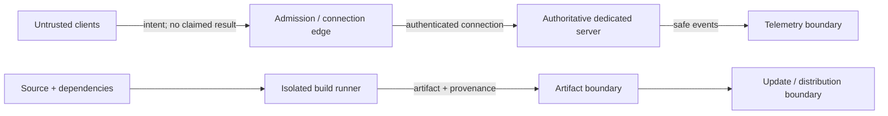
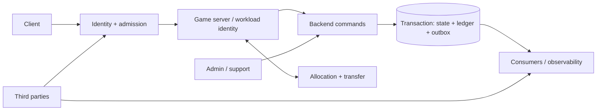

# Staged Multiplayer Threat Model

## Status and authority

- **Issue/version:** #40 baseline v1; authored 2026-08-20; independent review required before merge.
- **Scope:** implemented prototype authority seam and representative 1.0 architecture, with later target risks retained for design safety.
- **Authority:** subordinate to the canonical product and technical documents in the [documentation index](documentation-index.md). It specifies controls and tests; it changes no product rule, ADR, roadmap, or runtime.
- **Evidence policy:** `implemented` means tracked source exists, not that packaged evidence passed. `specified`/`deferred—not implemented` never means tested. Unknown tuning, legal/privacy conclusions, architecture, and providers remain `TBD` pending their owners.

## Staged baseline

| Stage | In scope here | Deferred coverage retained |
| --- | --- | --- |
| Prototype | Untrusted clients; admission/connection; one authoritative arena server; movement/attack authority, damage, lifecycle, telemetry; source/build/provenance/distribution | Persistent identity/economy, travel, faction world, administration |
| 1.0 representative | Identity/character ownership; hub/outdoor/dungeon admission and transfer; fenced persistence; bounded currency/reward ledger/outbox; operations | Inventory/equipment (1.1), admin tools (1.2), faction systems (2.x) |
| Target | Design tests for items, sanctuary/protected starts, contested resources, PvP rewards/collusion, invasions and admin plane | `deferred—not implemented`; canonical stages remain unchanged |

Issue #48 reassesses this baseline against real prototype evidence before 1.0 begins.

## Data-flow diagrams

Arrows crossing boxes are untrusted until authenticated, authorized, typed, bounded, version-compatible, and audited.

## Assets and safety properties

| ID | Stage; asset; owner | Required property / authority | CIA; evidence or revisit |
| --- | --- | --- | --- |
| AS-01 | P; connection/command stream; GameNet/GameCombat | Connection-bound principal; server validates sequence/time/type; server owns results | I/A; networking-authority-spike, #48 |
| AS-02 | P; combat state/timeline; GameCombat | Client cannot select target, hit, damage, defense, death or reward | I/A; focused source tests; packaged evidence open |
| AS-03 | P; telemetry; security/operations | Correlated safe reason, redacted inputs, evidence integrity | C/I/A; #40/#62; privacy review |
| AS-04 | P/1.0; source/dependency/artifact/provenance; build/release | Reproducible authorized artifact; traceable inputs; rollback | C/I/A; #13/#15/#16/#46 |
| AS-05 | 1.0; identity/session/character; identity owner | Authentication plus object/function authorization; single-use admission | C/I/A; #27/#35 |
| AS-06 | 1.0; lease/transfer; world+persistence | One current mutation authority; fenced epoch; durable terminal transfer | I/A; #37; failure injection |
| AS-07 | 1.0; progress/currency/reward; persistence | ACID state+receipt+ledger+outbox; idempotent; bounded integers | I/A; #27/#30; retry/crash evidence |
| AS-08 | 2.x; policy/protected topology; world | Most-specific protection wins; checks at activation and every application | I/A; deferred; #48 revisit |
| AS-09 | 2.x; PvP contribution/contested resources; progression | Server-owned eligibility, banking, loss and anti-collusion audit | I/A; deferred; product tuning TBD |
| AS-10 | 1.2+; admin/support authority; operations | Least privilege, approval where required, attribution, reversible recovery | C/I/A; deferred; qualified review |

Safety properties: fail closed on authorization, ambiguity, stale lease, policy/version mismatch and invalid durable command; retries return recorded terminal results; analytics/cache/client never become truth; overloaded authority rejects bounded work; failures do not expose secrets or detection rules.

## Trust boundaries and flows

| ID | From → to; data/command | Credential; validation point | Failure; telemetry; stage |
| --- | --- | --- | --- |
| FL-01 | Client → edge/server; session and gameplay intent | Connection/session proof; edge then authoritative handler | reject/close; principal+reason; P/1.0 |
| FL-02 | Server → telemetry; rejection/result | Workload identity; collector schema/redaction | bounded loss, never gameplay truth; correlation; P+ |
| FL-03 | Identity → admission → server; owned character | Single-use scoped admission; issuer and destination | deny replay/substitution; admission audit; 1.0 |
| FL-04 | Server → persistence; durable command | Workload identity+lease epoch; command owner | stale/version/conflict denial; command/lease audit; 1.0 |
| FL-05 | Source → allocator/destination; checkpoint/transfer | Scoped reservation/admission; each hop | expire/reconcile; transfer epoch audit; 1.0 |
| FL-06 | Transaction → outbox/consumer | Service identity; transaction then consumer dedupe | retry/reconcile; receipt/event IDs; 1.0 |
| FL-07 | Admin/support → control plane | Strong operator identity; policy/approval gate | deny and alert; actor/reason/change; 1.2+ |
| FL-08 | VCS/dependency → runner → artifact/update | Contributor/runner/signing identities TBD; isolated gates | quarantine/rollback; provenance; P+ |
| FL-09 | Third party → callback/service | Scoped secret/signature candidate; ingress validation | deny/retry bounded; redacted callback audit; 1.0+ |

## Consequential-command matrix

Each row covers all required dimensions. `TBD bound` forbids an invented number.

| ID; operation; stage/caller | Authn; object/function authz; typed validation | Replay; concurrency; rate/resource; timeout | Compatibility; safe error; redacted audit; owner; test |
| --- | --- | --- | --- |
| CM-01 admission/session; P/1.0 client | connection/admission proof; owned character+destination; IDs/state canonical | single-use; connection generation; TBD bound; cancel/expire | schema/build/protocol/content/policy; deny/retry; principal/session/reason; Net/Identity; TP-06 |
| CM-02 movement; P client | connection; possessed pawn; movement mode/vector finite | sequence dedupe; server simulation; TBD bound; bounded processing | protocol/build; correct/reject; connection/actor/reason; Combat; TP-01 |
| CM-03 aim; P client | connection; possessed pawn; normalized finite direction and temporal bound | sequence; authoritative view; TBD bound; bounded | schema/content; correction code; activation/reason; Combat; TP-01 |
| CM-04 attack/ability activation; P client | connection; pawn/ability eligibility; version, sequence,time,aim,state | dedupe; server timeline; TBD work; cancellation rule | schema/content/build; safe rejection; activation/reason; Combat; TP-01/02 |
| CM-05 hit/effect resolution; P server only | workload/runtime; active timeline/source/target; authored volume+policy | activation/already-hit; deterministic ordering; bounded samples; timeline expiry | content/policy; no client detail; result IDs; Combat; TP-02 |
| CM-06 dodge/block; P client, deferred gameplay | connection; possessed ability; state/window/direction | sequence; timeline order; TBD bound; cancel/expiry | content/protocol; correct/reject; activation/reason; Combat; specified TP-03 |
| CM-07 cooldown/resource commit; P server | runtime principal; ability/state; overflow-safe cost/prerequisites | activation ID; atomic GAS state; bounded work; timeline bound | content/schema; unavailable; activation/cost reason; Combat; TP-03 |
| CM-08 damage/death/respawn; P server | runtime principal; valid effect/actor; overflow-safe attributes+life state | result/transition ID; ordered state transition; bounded effects; lifecycle expiry | content/policy; authoritative correction; result/lifecycle; Combat; TP-02/04 |
| CM-09 item generate/move/equip; 1.1 client request | deferred—not implemented; server-only generation requires workload identity; client move/equip requires connection/admission proof; owner/container/function; typed table/item/slot | idempotency key; state version+lease; bounded batch; cancel/expire | schema/table/algorithm/key; deny/conflict; item command; Persistence; FU-12 |
| CM-10 loadout/Skein/Doctrine; 1.1/2.0 client | deferred—not implemented; connection/admission proof required; owned character+allowed option; distinct state/version rules | idempotent; state version+lease; bounded set; timeout/cancel to recorded terminal denial | schema/content/policy; deny/conflict; option/version; Progression; FU-12 |
| CM-11 reward/currency/progress; 1.0 server | workload+lease; eligible completion; bounded signed/unsigned conversion | command+receipt key; ACID version/fence; bounded grant; transaction timeout | schema/algorithm/content; recorded result/conflict; receipt+ledger; Persistence; FU-03 |
| CM-12 territory/sanctuary/objective; 2.x server | deferred—not implemented; workload identity required; authoritative actor/objective; source+target hierarchy | decision/event ID; immutable policy version; bounded lookup; fail closed | policy/content/schema; generic policy denial; policy/version/reason; World; FU-05 |
| CM-13 bank/contested-resource loss; 2.0 client request/server | deferred—not implemented; connection/admission proof and workload identity required; eligible character/service/resource; bounded quantity/category/location | receipt; transaction+lease; bounded batch; timeout/reconcile | policy/schema/content; deny/recorded result; receipt/policy; Persistence; FU-06 |
| CM-14 transfer/reserve/admit; 1.0 server/client admission | workload+single-use proof; character/source/destination; checkpoint/versions/routes | TransferId; durable state+epoch; capacity TBD; expiry/recovery | build/protocol/content/policy/schema; safe return/deny; transfer states; World; FU-04 |
| CM-15 lease acquire/advance/release; 1.0 workload | workload identity; character/process function; epoch/state | operation ID; CAS/fencing; bounded leases; expiry | schema/policy; stale/conflict; old/new epoch; Persistence; FU-03/04 |
| CM-16 admin/support/grant; 1.2+ operator | deferred—not implemented; strong operator identity required; scoped role/object/approval; typed reason/change | request ID; state version+lease; resource bound; session/job timeout | schema/policy; deny/ticket ref; actor/reason/before-after; Ops; FU-07 |
| CM-17 third-party callback; 1.0+ provider | deferred—not implemented; evidence-gated scoped signature/secret candidate; event ownership+allowlist; canonical payload | provider event ID; state/version; body/rate bound; timeout/retry | provider/schema/policy; generic accept/deny; provider/event/reason; Identity/Ops; FU-02 |
| CM-18 build/sign/publish/update/rollback; P+ runner/operator | contributor/workload/signing identity TBD; protected workflow; pinned inputs/provenance | immutable run/artifact ID; protected ref/release state; bounded job; cancel/expiry | toolchain/plugin/SDK/schema/channel; quarantine/rollback; source+digest+approvals; Release; FU-08 |

## Abuse ranking and register

Vocabulary: likelihood = Low (special access), Medium (plausible conditions), High (routine access/repeatable), TBD (no evidence); impact = Low (limited reversible), Medium (material bounded), High (authority/economy/service compromise), Critical (broad durable/trust compromise); detectability = High (reliable prompt signal), Medium (correlation needed), Low (weak/delayed signal), TBD; exploit cost = Low/Medium/High/TBD for attacker effort/access. These are ordinal judgments, not probabilities.

All rows use: preventive/detective/recovery controls; test; telemetry; owner; residual risk; disposition; evidence; revisit; follow-up.

| ID; stage; asset/attacker/precondition; abuse | L/I/D/cost; rationale | Controls; test; telemetry; owner; residual/disposition; evidence; revisit; FU |
| --- | --- | --- |
| TH-01 P; command/client/connection; forge movement, aim, activation, hit, dodge, block, cooldown, damage or death | H/H/H/L; untrusted client | server-owned typed command/result absence; rejection correlation; authoritative reset; TP-01/03; actor+reason; Combat; M/open; source tests only; packaged/adversarial evidence; FU-01 |
| TH-02 1.0; identity/attacker/credential; broken object/function auth, replay/substitution, callback abuse | M/H/M/M; boundary unbuilt | scoped short-lived/single-use proof, ownership/function checks; alert/revoke; TP-06; principal/object/reason; Identity; H/open; specified; identity design/provider change; FU-02 |
| TH-03 P+; service/remote/load; connection, command, query, telemetry or decompression exhaustion | H/H/M/L; public work | staged bounds/backpressure/admission shedding; saturation alerts/recovery; TP-07; resource+reason; Ops/system; H/open; thresholds TBD; load evidence/capacity change; FU-09 |
| TH-04 1.0; lease/compromised or stale server; split brain/stale epoch | M/C/M/M; durable authority | workload identity, CAS lease+fencing; conflict alert; isolate/reconcile; TP-08; epoch/instance; Persistence; H/open; specified; persistence implementation/failure; FU-03/04 |
| TH-05 1.0; economy/client or retry/crash; forged or ineligible reward grant, duplicate reward/outbox delivery | M/C/M/L; untrusted requests and retries cross an unbuilt durable boundary | workload identity+lease, server-owned eligibility, no client grant authority, atomic receipt+ledger+outbox and consumer dedupe; rejection correlation and reconciliation; TP-09; principal/eligibility/command/receipt/event/reason; Persistence; H/open; specified—not implemented or tested; reward transaction/eligibility implementation; FU-03 |
| TH-06 1.0+; integer/client/content; signed/unsigned boundary, overflow, underflow, truncation | M/H/H/L; common parser edge | explicit types/bounds/checked arithmetic/canonical conversion; reject/reconcile; TP-10; field+safe reason; Persistence; M/open; specified; schema/type change; FU-03 |
| TH-07 1.0; transfer/fault/stale participant; interruption, replay, double admission, destination/source authority | M/C/M/M | durable states, checkpoint, single-use admission, fence, safe return; TP-08; TransferId/state/epoch; World; H/open; specified; transfer implementation/topology change; FU-04 |
| TH-08 2.x; policy/player/proxy; bypass sanctuary/protected start via effects or transitions | M/C/M/M; broad path set | most-specific server policy at activation+every application, topology isolation; TP-11; policy/source/target/path; World; H/open; deferred; first faction implementation/policy change; FU-05 |
| TH-09 2.0; reward/players; collusion, kill trading, repeat-victim farming, contribution forgery | H/H/L/L; social coordination | server contribution, repeat/collusion signals, no client grants, reversible hold; TP-12; parties/victims/objectives/receipts; Progression/Security; H/open; thresholds TBD; PvP reward design; FU-06 |
| TH-10 2.0; contested resources/player; forge eligibility/quantity, race bank/loss, disconnect laundering | M/H/M/L | server inventory/policy, ACID banking/loss receipt, fence; reconcile; TP-12; policy/resource/receipt; Persistence; H/open; deferred; resource design; FU-06 |
| TH-11 1.2+; admin/support/operator compromise; unauthorized travel/grant/account change or audit suppression | M/C/M/M | least privilege, strong identity, separation/approval, immutable audit, revoke/restore; TP-13; actor/session/change; Ops; H/open; deferred; admin capability introduced; FU-07 |
| TH-12 P+; supply chain/contributor/dependency; dependency, runner, artifact, plugin/SDK/toolchain compromise | M/C/L/M | pin/review/isolate/scan/provenance/reproducibility; quarantine/rebuild; TP-05; source/digest/runner; Release; H/open; provider TBD; input/runner change; FU-08 |
| TH-13 P+; signing/update/operator/key; key theft, unsigned/wrong-channel update, rollback suppression | M/C/L/H | isolated scoped signing candidate, verified manifest/channel, rollback; TP-05; signer/digest/channel; Release; H/open; signing unselected; external distribution/key change; FU-08 |
| TH-14 P+; secrets/logs/insider; secret or personal-data exposure | M/H/M/L | external secret store candidate, minimization/redaction/access; revoke/purge per qualified policy; TP-05; access/redaction signal; Ops; H/open; retention/legal TBD; data/provider change; FU-10 |
| TH-15 1.1/2.0; item and loadout state/client/connection; forge item generation, move or equip, or mutate another character or unauthorized loadout/Skein/Doctrine option | H/H/M/L; routine client access reaches deferred consequential commands | connection/admission proof, workload identity for generation, object/function/owner/container/table/slot/option authorization, typed versioned commands, state version+lease, idempotency and atomic commit; rejection correlation and reconcile recorded state; TP-14; principal/character/item/container/table/slot/option/version/command/reason; Persistence/Progression; H/open; deferred—not implemented or tested; first item/loadout/Skein/Doctrine command implementation or schema/policy change; FU-12 |

## Sanctuary and protected-start cross-product

For every cell below and every transition path, the authoritative server resolves source and target policy at activation **and every effect application/tick/contact**; protection wins, missing/ambiguous/incompatible policy fails closed, and protected-start topology has no rival admission route. This is target specification, `deferred—not implemented`.

| Hostile-effect family | Normal boundary; teleport/fast travel; reconnect/respawn | Possession; transfer/reservation; invasion topology; policy/content change |
| --- | --- | --- |
| Direct abilities; melee volumes; projectiles | Reject protected source/target on activation and application | Re-resolve identities, topology and version on every application |
| Persistent areas; periodic effects; summons/pets | Recheck crossing, spawn and every tick/contact | Fence old owner; reject stale or newly protected applications |
| Traps; forced movement/knockback | Recheck trigger and displacement destination | Never move/admit into protected topology through proxy/fallback |
| Objective/environment proxies | Attribute authoritative instigator/policy; no laundering | Version/check objective and invasion scope; preserve beginner services |

## Representative test plan

| ID; stage; threat/control | Fixture/action or fault | Oracle; safe client; telemetry; automation/environment; owner; evidence |
| --- | --- | --- |
| TP-01 P; TH-01 | malformed/stale/duplicate/version/timestamp/aim intents | server reject/no mutation; safe reason; correlated rejection; focused automation/local; Combat; implemented source tests, not packaged |
| TP-02 P; TH-01 | valid intent plus client-claimed-result absence; contact/damage | server-authored volume and damage only; correction/result; activation trace; focused automation/local; Combat; implemented source tests |
| TP-03 P; TH-01 | invalid movement/activation/hit/cooldown/dodge/block/damage probes | no claimed outcome accepted; safe reason; category+reason; fixture/packaged future; Combat; probe seam exists, gameplay partial/deferred |
| TP-04 P; AS-01/02 | join, disconnect cleanup, reconnect/new identity, death/respawn | old connection cannot command; authoritative lifecycle; IDs; focused+packaged; Net/Combat; focused contracts exist, packaged open |
| TP-05 P+; TH-12-14 | altered input/artifact/manifest, secret marker, rollback | mismatch quarantined; generic failure; provenance/redaction event; CI/clean machine; Release; specified/partial CI evidence only |
| TP-06 1.0; TH-02 | wrong owner/function, replayed admission/callback | deny without existence leak; authz audit; integration/development; Identity/FU-02; untested |
| TP-07 P+; TH-03 | bounded flood/slow dependency/cancellation | authority remains enforced or sheds admission; resource event; load/fault injection; Ops/FU-09; untested, thresholds TBD |
| TP-08 1.0; TH-04/07 | crash/reorder at every transfer/lease state; stale write | one current epoch/durable terminal state; retry/safe return; transfer audit; multi-process development; World/Persistence; untested |
| TP-09 1.0; TH-05 | client-forged or ineligible reward request; retry/crash before/after transaction and outbox delivery | forged/ineligible grant denied with no mutation and no existence leak; eligible retries yield one visible grant/receipt and recorded terminal result; principal/eligibility/reason plus ledger/receipt/event IDs; integration/development; Persistence; untested |
| TP-10 1.0; TH-06 | min/max, negative-to-unsigned, overflow arithmetic/serialization | reject or exact bounded commit; safe validation; field reason; property/boundary; Persistence; untested |
| TP-11 2.x; TH-08 | every sanctuary matrix cell and transition | no protected hostile effect/admission; policy rejection; source/target/path/version; automation+topology; World/FU-05; deferred |
| TP-12 2.0; TH-09/10 | repeat victims, coordinated parties, forged contribution, banking/loss races | no duplicate/ineligible value; generic result; graph+receipt telemetry; simulation; Progression/FU-06; deferred |
| TP-13 1.2+; TH-11 | unauthorized role/object, approval bypass, stolen session, audit outage | deny/no mutation; alert; actor/change; control-plane exercise; Ops/FU-07; deferred |
| TP-14 1.1/2.0; TH-15 | wrong owner/function/table/container/slot/option; client-forged item; replayed command; stale state version or lease for generate/move/equip and loadout/Skein/Doctrine mutation | deny/no mutation or duplicate; generic denial/conflict; principal/character/item/table/container/slot/option/version/command/reason; integration/development; Persistence/Progression/FU-12; deferred—not implemented or tested |

## Risk decisions

Allowed states are `open`, `mitigated`, `accepted`, `blocked`. Acceptance requires accountable owner, concrete evidence, rationale and scope, compensating controls, expiry/event trigger, and Issue #48 handoff. No supplied evidence authorizes acceptance.

| Risk | State; owner | Evidence/rationale/controls | Residual; expiry/revisit; #48 |
| --- | --- | --- | --- |
| R-01 TH-01 prototype command abuse | open; GameCombat/GameNet | Focused source tests exist; packaged/adversarial evidence absent | Medium/high TBD; packaged capture or authority change; reassess #48 |
| R-02 TH-02-15 future boundaries | open; row owners | Specification only; implementation evidence absent | High/TBD; corresponding feature/vendor/topology introduction; reassess #48 and later stage gates |

## Candidate register

Unselected candidates only: identity/platform services, backend/database/cache/messaging, hosting/orchestration, anti-cheat/client integrity, secret management/KMS, security/SBOM/scanning, signing/notarization, artifact/update distribution, observability/crash reporting, payment/communications where later applicable. Selection requires the owning ADR/evidence, privacy/security/exit review, and does not transfer gameplay authority.

## Objective follow-up specifications (proposed; no issues created)

| ID; proposed title; source | Owner/stage; bounded acceptance and exact evidence | Dependencies; non-goals |
| --- | --- | --- |
| FU-01 Prototype gameplay-command abuse automation; TH-01 | Combat/P; all intent families reject/no mutation under reorder/replay; automation logs+packaged correlated capture | #2/#44; no tuning/rewind choice |
| FU-02 Admission, identity and authorization; TH-02 | Identity/1.0; ownership/function/callback matrix passes; threat tests+redacted audit | #35/#36; no vendor selection here |
| FU-03 Fenced persistence and reward boundaries; TH-04-06 | Persistence/1.0; stale epochs, retry/crash, forged/ineligible rewards, integer boundaries yield denial or one commit as applicable; DB transaction/ledger/outbox and redacted authorization evidence | #27/#30/#37; no inventory before 1.1 |
| FU-04 Transfer failure and split authority; TH-04/07 | World/1.0; each state fault proves one authority and safe terminal recovery; multi-process traces | allocator/persistence; no topology vendor |
| FU-05 Sanctuary/protected-start hostile-family tests; TH-08 | World/2.x; full cross-product denies protected effects/admission; policy/version traces | canonical topology; no claim systems exist early |
| FU-06 PvP reward/collusion controls; TH-09/10 | Progression/2.0; repeat/collusion/resource race fixtures cannot create value; receipts+reviewable signals | reward design TBD; no invented threshold |
| FU-07 Admin-plane controls; TH-11 | Ops/1.2+; role/object/approval/session/audit-outage tests pass; immutable audit and recovery exercise | capability design; no provider choice |
| FU-08 Supply-chain/release integrity; TH-12/13 | Release/P+; altered dependencies/runner/artifact/signature/channel fail; reproducible provenance+rollback evidence | #15/#16/#46; no signing vendor selection |
| FU-09 Resource-exhaustion controls; TH-03 | System/P+; bounded fault/load cases preserve authority or shed safely; captures and recovery log | #45; thresholds remain evidence-owned |
| FU-10 Privacy/retention qualified review; TH-14 | Data owners/P+; inventory/purpose/access/region/retention decisions recorded by qualified reviewers | real data/provider; no legal conclusion |
| FU-11 Incident and recovery exercises; TH-04/05/11-14 | Ops/1.0+; tabletop plus restore/reconcile/revoke/rollback exercise produces timeline, gaps, owners | implemented controls; no invented RPO/RTO |
| FU-12 Item and loadout command authorization; TH-15 | Persistence/Progression/1.1/2.0; wrong-owner/function/table/container/slot/option, forged-item, replay and stale-state fixtures deny or return one recorded result; automated results+redacted command/rejection/reconciliation evidence | inventory/equipment and Skein/Doctrine command designs; no item tuning, faction-name decision, or implementation before canonical stage |

## Review and acceptance mapping

Criterion 10 requires fresh independent review of the prototype baseline and representative 1.0 test plan against Issue #40 and canonical security/architecture sources before merge; that review must record unresolved risks, evidence exceptions, and merge readiness in launcher-sealed stage evidence; the document itself claims no review, approval, or gate result; implementation/runtime evidence, open risks, tuning, legal/privacy conclusions, and vendor selections remain unresolved; Issue #48 must reassess before 1.0 and on material changes.

| Acceptance | Evidence |
| --- | --- |
| Flows/boundaries/assets/safety | diagrams; AS/FL |
| Four-axis ranking and abuse families | TH-01–15 and vocabulary |
| Consequential commands/all control dimensions | CM-01–18 |
| Sanctuary/travel/protected starts | cross-product; TH-08; TP-11 |
| High-risk completeness | every TH row: controls, test, telemetry, owner, residual, revisit |
| Objective specifications | FU-01–12 |
| Baseline/tests/accepted-risk evidence | staged baseline; TP; R-01/02 |
| Reassessment and unselected vendors | review section; candidate register; Issue #48 |
